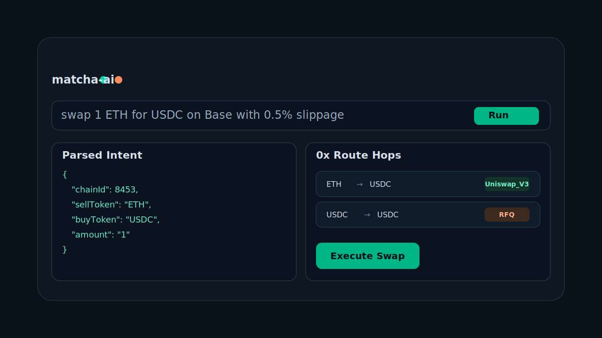

# valence



Institutional-grade AI trading terminal built on 0x Swap API v2 and 0x Gasless API.

`valence` translates natural language like `swap 1 ETH for USDC on Base` into typed intents, fetches live 0x routes, and executes through wagmi + viem. The UI is a Bloomberg-inspired terminal with dense market context, route visualization, transaction lifecycle tracking, and command-driven workflows.

## Highlights

- Prompt -> intent -> quote -> execution pipeline with visible intermediate JSON
- SWAP, INTENT, QUOTES, and GASLESS operational modes
- Typed 0x service layer (no raw fetch in React components)
- Wallet UX via wagmi v2 + viem + RainbowKit
- Zustand global state for chain, drafts, telemetry, history, and command palette
- Full route visualizer and output log panel
- Seven runnable live API examples under `/examples`

## Architecture

```text
Natural language input
  -> Intent parser (OpenAI or deterministic fallback)
  -> Structured SwapIntent
  -> 0x API adapter (Swap v2 / Gasless)
  -> Transaction/signature construction
  -> Wallet execution and history tracking
```

## Stack

- Vite + React + Chakra UI
- TypeScript strict mode
- Zustand
- wagmi + viem + RainbowKit
- 0x Swap API v2 + 0x Gasless API
- ESLint + Prettier

## Quick Start

```bash
npm install
cp .env.example .env.local
```

Required environment values:

- `ZEROX_API_KEY` (Node/examples)
- `VITE_ZEROX_API_KEY` (frontend)
- `VITE_WALLETCONNECT_PROJECT_ID` (wallet connector)

Run UI:

```bash
npm run dev -- --host 0.0.0.0 --port 5173
```

## Examples

Run each directly:

```bash
npx ts-node examples/01-quote.ts
npx ts-node examples/02-swap.ts
npx ts-node examples/03-gasless.ts
npx ts-node examples/04-token-approval.ts
npx ts-node examples/05-intent-parse.ts
npx ts-node examples/06-multi-hop.ts
npx ts-node examples/07-price-watch.ts
```

## Repo Docs

- [Task 0 Comprehension Report](./docs/task-0-comprehension-report.md)
- [Task 1 Protocol Mapping](./docs/task-1-protocol-mapping.md)

## Build and Quality

```bash
npm run typecheck
npm run lint
npm run build
```

## Notes

- UI currently uses `@fontsource/iosevka`, `@fontsource/iosevka-aile`, and `@fontsource/iosevka-etoile`; fixed/ss08 behavior is enforced via font-family priorities and feature settings.
- Browser-side API keys are appropriate for local demos; production usage should proxy 0x requests through a secure backend.
